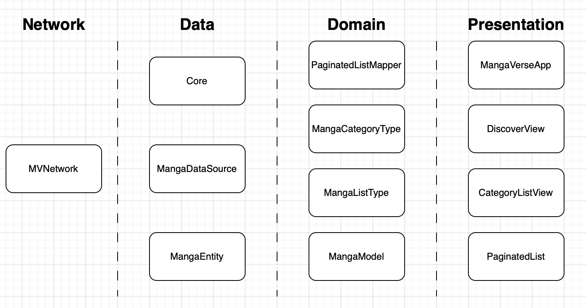

## POC MangaVerse iOS app
### Resumen
MangaVerse es una aplicación móvil para iOS y una prueba de concepto que ofrece diversas funcionalidades para explorar mangas. Permite acceder a sus detalles y ampliar la información sobre su bibliografía.

El proyecto pretende aplicar conceptos de arquitectura limpia, principios SOLID, patrones de diseño y modularización. Además, utiliza Swift Package Manager y SwiftUI dentro de una arquitectura MVVM.

Hasta el momento, MangaVerse está estructurado de la siguiente manera:

* **Network:** Se desarrolló un módulo genérico para realizar llamadas al servidor y desacoplar esta responsabilidad de la aplicación. Actualmente, solo permite realizar solicitudes al servidor especificado en los requisitos.
* **Data:** Esta capa se encarga de abstraer y decodificar la data del servidor para transferirla a la capa de dominio. Incluye la creación de fuentes de datos y entidades. El núcleo (Core) proporciona utilidades para implementar nuevas fuentes de datos de manera sencilla.
* **Domain:** En esta capa se gestiona la data del servidor, estructando las reglas de negocio para facilitar su presentación en la capa de presentación. Utilizamos un mapper, un modelo y varios enums para este propósito.
* **Presentation:** Aquí se encuentran todas las pantallas construidas con SwiftUI, así como algunos componentes reutilizables y la gestión de dependencias a lo largo de la aplicación.

### Funcionalidades incorporadas hasta ahora:
- **Listado con scroll infinito:** Permite descubrir mangas utilizando el servicio myManga-Academy.
- **Calificación visual:** Los mangas muestran su puntuación con un color que varía según su calificación.
- **Sección de categorías y subtipos:** Cada categoría y subtipo lleva a un listado correspondiente para explorar mangas y sus detalles. La pantalla se adapta dinámicamente a la estructura del servidor, lo que evita la necesidad de modificar el proyecto si se agregan nuevas categorías o subtipos.
- **Funcionalidad de búsqueda:** Permite encontrar mangas mediante palabras clave o nombres.

### Funcionalidades aún no incorporadas:
- **Manejo de sesión:** Permitir la navegación como usuario registrado.
- **Gestión de mangas:** Funcionalidades como guardar, archivar, y marcar como favorito.
- **Pantalla de perfil:** Para la gestión de datos del usuario.

### Accidentes felices:
- **Pantalla reutilizable:** Después de varias iteraciones de diseño, se logró desarrollar una pantalla reutilizable llamada PaginatedListView. Esta se utiliza en todas las pantallas para desplegar el listado de mangas y sus detalles.

### Desastres:
- **Implementación de persistencia:** Encontrar la forma de implementar la persistencia fue un desafío complejo que, a nivel personal, no logré aplicar de manera óptima. Intenté aprovechar el modificador .environment(), pero al reutilizar la pantalla de listado para mangas, la data de otras pantallas se mezclaba en lugares donde no correspondía.

MangaVerse sigue en desarrollo, y con mucho esfuerzo he intentado materializar todos los requisitos exigidos por la Apple Coding Academy. Sin embargo, el tiempo ha sido un factor, y esta versión es lo que puedo entregar por el momento. Lamento cualquier inconveniente que esto pueda causar.

### Agradecimientos:
- **Arturo:** Por toda tu sabiduría. ¡Aún sigo dándole vueltas a tus videos!
- **Alberto:** Por las tutorías, la rápida atención y la cortesía al revisar uno de mis PRs.
- **Javier:** Gracias por tu paciencia y por compartir tu valiosa experiencia, que ha sido un pilar fundamental para superar mis inseguridades en este gran viaje.
- A todo el equipo de la Apple Coding Academy por esta maravillosa oportunidad.
